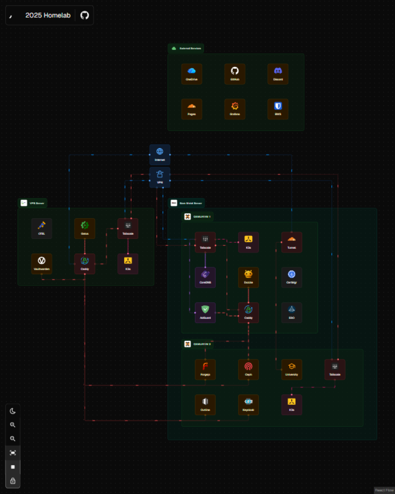

<h1 align="center">
  
  homelab
</h1>

  How I built my homelab

---

<table>
  <tr>
    <th>Platform</th>
    <td>
      

        
        
        
        
      

    </td>
  </tr>
  <tr>
    <th>Tooling</th>
    <td>
      

        
        
        
        
        
      

    </td>
  </tr>
</table>

## **Overview**

### **Servers**

My servers mostly run inside Proxmox with Debian as the OS. You can check [my ansible code](./ansible/) to see how I deploy the VMs.

All my services are containerized, using [Docker Compose](./docker/) or [orchestrated with Kubernetes](./kubernetes/).

Some highlighted components of the stack:
1. [K3s](https://k3s.io/) as the K8s distribution I use
2. [Flux](https://fluxcd.io/) as my GitOps solution for Kubernetes
3. [Bitwarden Secrets Manager](https://bitwarden.com/products/secrets-manager/) for storing my secrets and consuming them programmatically
4. [Ansible](https://ansible.com/) to deploy new VMs inside Proxmox
5. [Renovate](https://github.com/renovatebot/renovate) to keep my services always up to date

### **IoT**

_Soon_

### **External Services**

I decided not to self-host all my infra because some of the services need near-perfect reliability.

<table>
  <thead>
    <tr>
      <th>Service</th>
      <th>Purpose</th>
      <th>Why</th>
    </tr>
  </thead>
  <tbody>
    <tr>
      <td>
      <a href="https://bitwarden.com/products/secrets-manager">Bitwarden Secrets</a>
      </td>
      <td>Storing Secrets
      </td>
      <td>
      Self-hosting this creates a chicken-and-egg problem during recovery
      </td>
    </tr>
    <tr>
      <td>
      <a href="https://www.microsoft.com/en-us/microsoft-365/onedrive/online-cloud-storage">OneDrive</a>
      </td>
      <td>Storing backups
      </td>
      <td>
      They offer a good price compared to other solutions
      </td>
    </tr>
    <tr>
      <td>
      <a href="https://github.com/">GitHub</a>
      </td>
      <td>Hosting code
      </td>
      <td>
      The most popular hosted Git service with many free benefits
      </td>
    </tr>
    <tr>
      <td>
      <a href="https://grafana.com/products/cloud/">Grafana</a>
      </td>
      <td>Storing logs and metrics
      </td>
      <td>
      They offer enough features for me
      </td>
    </tr>
    <tr>
      <td>
      <a href="https://www.biznetgio.com/">Biznet Gio</a>
      </td>
      <td>Routing Public Traffic
      </td>
      <td>
      One of the most affordable providers with good service in my country
      </td>
    </tr>
  </tbody>
</table>

## **Yearly Recap**

### **2025**

<table>
  <thead>
    <tr>
      <th align="center">Tech Stack</th>
      <th align="center">Wrap</th>
    </tr>
  </thead>
  <tbody>
    <tr>
      <td align="center" valign="top">
        <a href="https://2025-homelab.hilmo.dev/">2025-homelab.hilmo.dev</a>
          
        
      </td>
      <td align="center" valign="top">
        <a href="https://2025-homelab.hilmo.dev/">https://2025-homelab.hilmo.dev/</a>
          
        
      </td>
    </tr>
  </tbody>
</table>

## **Hardware**

### Server

<table>
  <thead>
    <tr>
      <th>Device
      </th>
      <th>CPU
      </th>
      <th>RAM 
      </th>
      <th>Storage 
      </th>
      <th>Purpose
      </th>
    </tr>
  </thead>
  <tbody>
    <tr>
      <td>Lenovo ThinkCentre M720Q
      </td>
      <td>Intel i5 8600T
      </td>
      <td>
        2x16GB DDR4 SODIMM
        
      </td>
      <td>1x250GB SATA SSD, 1x240GB NVMe
      </td>
      <td>Main Server
      </td>
    </tr>
    <tr>
      <td>Lenovo ThinkCentre M710Q
      </td>
      <td>Intel i5 7500T
      </td>
      <td>
        1x8GB DDR4 SODIMM
        
      </td>
      <td>
        1x128GB SATA SSD
        
      </td>
      <td>Home Assistant Server
      </td>
    </tr>
  </tbody>
</table>

## **Getting Started**
To build a similar homelab, I highly recommend starting with the official documentation for each component in the stack. Use my infra as reference only.

### **Caveats**
The infrastructure I used, especially the configuration inside the [kubernetes folder](./kubernetes/), is highly tuned for my low-resource environment. My Kubernetes cluster is also not HA (High Availability), it contains only a single Control Plane and two Agents.

1. Disabled Services: I disable several embedded K3s services to save resources. Check the list [here](./kubernetes/Taskfile.yml).
2. Custom DNS: I use a custom DNS configuration to ensure resolution availability even if half of my nodes die. Check the manifest [here](./kubernetes/infra/system/coredns.yaml).
3. Storage: I primarily use `hostPath` volumes to avoid the overhead of distributed storage solutions.
4. Scheduling: I extensively use `nodeSelector` in manifests to manually control which nodes handle high-resource workloads.